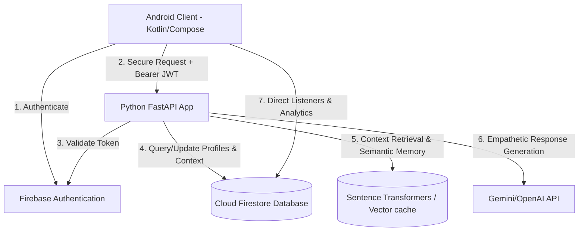
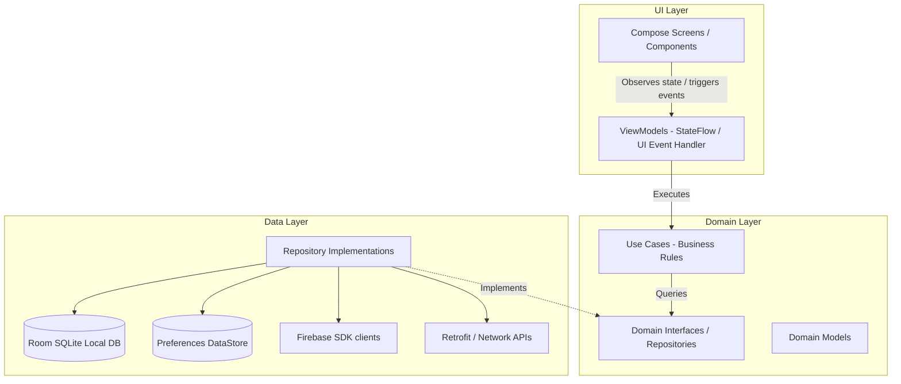
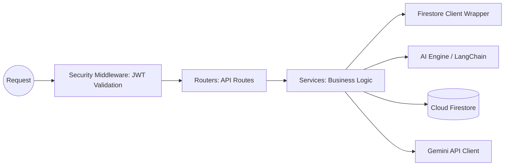
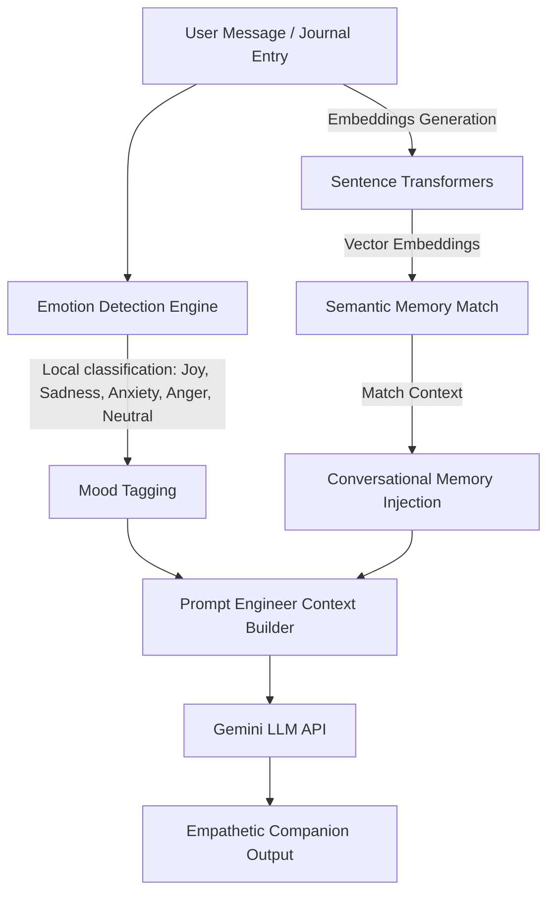
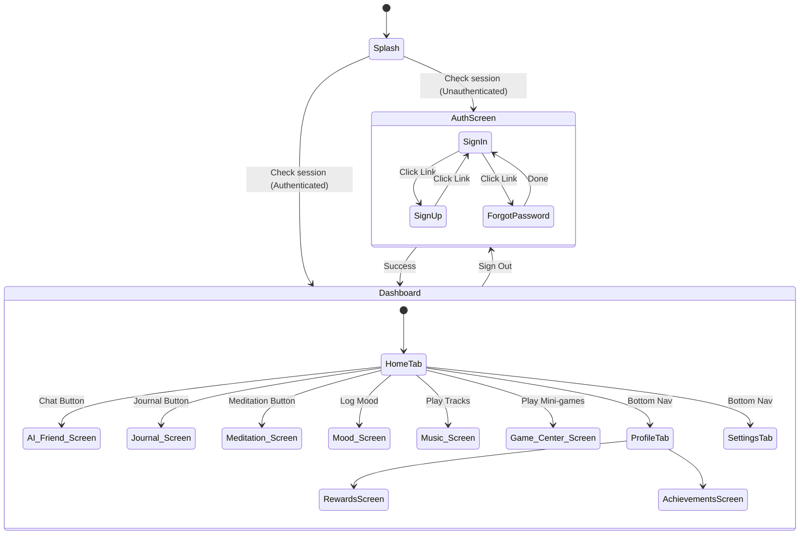
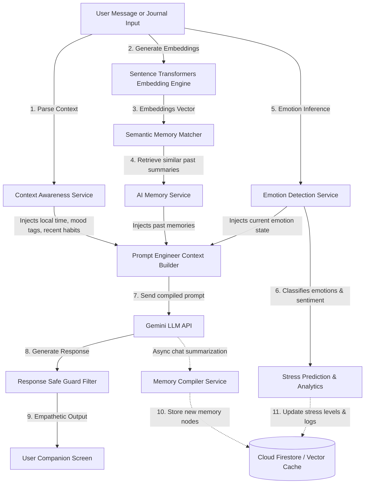

# Aura AI - Software Architecture Specification

Aura AI is an AI-driven Emotional Wellness Companion. This document defines the complete technical specifications, architecture diagrams, module structures, and implementation rules.

---

## 1. Overall System Architecture

Aura AI follows a client-server architecture with cloud database storage and external AI service integrations.



---

## 2. Android Architecture (MVVM + Clean Architecture)

The Android application is structured according to Clean Architecture guidelines divided into three primary layers: **UI (Presentation)**, **Domain**, and **Data**.



- **UI Layer**: Handles Compose layouts, Material 3 styling, and manages UI states. Interacts with the viewmodels.
- **Domain Layer**: Holds the core platform-agnostic business rules. Completely decoupled from third-party frameworks.
- **Data Layer**: Coordinates caching policies, database inputs/outputs, network API calls, and handles offline support.

---

## 3. Backend Architecture (FastAPI Async)

The backend is built as a stateless, asynchronous FastAPI web application.



- **Asynchronous Execution**: Fully utilizes `async` and `await` for HTTP client calls and Firestore read/writes to maximize I/O performance.
- **Dependency Injection**: Relies on FastAPI `Depends` for request configuration, databases access, and session context verification.

---

## 4. Firebase Architecture

Firebase provides the foundation for our serverless security, authentication, and hosting features:

- **Firebase Authentication**: Handles registration, login (email/password, OAuth), and token generation.
- **Cloud Firestore**: Non-relational document database for user profiles, mood logs, and conversational memory.
- **Firebase Storage**: Stores audio files, generated journal assets, and user profile photographs.
- **Firebase Cloud Messaging (FCM)**: Sends personalized notifications, wellness reminders, and alerts.
- **Firebase Analytics & Crashlytics**: Monitors application performance, usage patterns, and captures bugs.
- **Firebase Remote Config**: Adjusts experimental features, UI settings, and parameters on-the-fly.

---

## 5. AI & Emotion Detection Architecture

Aura AI implements a hybrid AI pipeline for personalized interactions and mood analysis:



- **Emotion Detection Engine**: Classified locally or in backend using Sentence Transformers and Scikit-learn algorithms to capture fine-grained emotional indices.
- **AI Memory (Context Management)**: Implements semantic lookup over historical chats. The backend embeds user entries and runs a similarity search to inject relevant memories into the LLM context window.

---

### 6. Folder Structure

The project structure is organized as follows:
```
.
├── android/
│   ├── app/
│   │   ├── src/
│   │   │   ├── main/
│   │   │   │   ├── java/com/auraai/
│   │   │   │   │   ├── data/                 # Repositories, Databases, API Clients
│   │   │   │   │   │   ├── local/            # Local Storage
│   │   │   │   │   │   │   ├── db/
│   │   │   │   │   │   │   │   └── AuraDatabase.kt      # Room caching (CachedMoodEntity/MoodDao)
│   │   │   │   │   │   │   └── preferences/
│   │   │   │   │   │   │       └── PreferenceManager.kt # Jetpack DataStore (Theme/Remember Me)
│   │   │   │   │   │   ├── remote/           # Firebase Wrappers, FastAPI Client
│   │   │   │   │   │   │   └── api/
│   │   │   │   │   │   │       └── AuraApiService.kt    # Retrofit Base Client & DTO Schemas
│   │   │   │   │   │   └── repository/       # Repository Implementations
│   │   │   │   │   │       ├── FirebaseAuthRepositoryImpl.kt
│   │   │   │   │   │       ├── MoodRepositoryImpl.kt
│   │   │   │   │   │       └── ChatRepositoryImpl.kt
│   │   │   │   │   ├── domain/               # Core Business Rules (Domain boundaries)
│   │   │   │   │   │   ├── model/
│   │   │   │   │   │   │   ├── AuthState.kt
│   │   │   │   │   │   │   ├── ChatMessage.kt
│   │   │   │   │   │   │   └── MoodLog.kt
│   │   │   │   │   │   ├── repository/
│   │   │   │   │   │   │   ├── AuthRepository.kt
│   │   │   │   │   │   │   ├── MoodRepository.kt
│   │   │   │   │   │   │   └── ChatRepository.kt
│   │   │   │   │   │   └── usecase/
│   │   │   │   │   │       ├── AuthUseCases.kt
│   │   │   │   │   │       ├── MoodUseCases.kt
│   │   │   │   │   │       └── ChatUseCases.kt
│   │   │   │   │   ├── ui/                   # UI Presentation Layer (Screens/ViewModels)
│   │   │   │   │   │   ├── auth/
│   │   │   │   │   │   │   ├── AuthScreen.kt
│   │   │   │   │   │   │   └── AuthViewModel.kt
│   │   │   │   │   │   ├── mood/
│   │   │   │   │   │   │   ├── MoodLogScreen.kt
│   │   │   │   │   │   │   └── MoodViewModel.kt
│   │   │   │   │   │   ├── chat/
│   │   │   │   │   │   │   ├── ChatScreen.kt
│   │   │   │   │   │   │   └── ChatViewModel.kt
│   │   │   │   │   │   ├── navigation/
│   │   │   │   │   │   │   └── NavRoute.kt          # Strongly typed routes structure
│   │   │   │   │   │   └── theme/                # Custom Material 3 Styling Tokens
│   │   │   │   │   │       ├── Color.kt
│   │   │   │   │   │       ├── Type.kt
│   │   │   │   │   │       └── Theme.kt
│   │   │   │   │   │   └── MainActivity.kt       # Activity Entry (AuraTheme wrapped)
│   │   │   │   │   └── di/                   # Dagger Hilt Injectors
│   │   │   │   │       ├── AppModule.kt
│   │   │   │   │       ├── DatabaseModule.kt # Injects AuraDatabase and Dao singletons
│   │   │   │   │       ├── NetworkModule.kt  # Injects OkHttp client and Retrofit services
│   │   │   │   │       └── RepositoryModule.kt # Binds interfaces to implementation classes
│   │   │   │   └── AndroidManifest.xml
│   │   │   └── src/test/java/com/auraai/     # JVM Unit Tests
│   │   │       ├── domain/usecase/AuthUseCasesTest.kt
│   │   │       └── ui/
│   │   │           ├── auth/AuthViewModelTest.kt
│   │   │           ├── mood/MoodViewModelTest.kt
│   │   │           └── chat/ChatViewModelTest.kt
│   │   │   └── build.gradle.kts
│   │   └── build.gradle.kts
│   └── settings.gradle.kts
└── backend/
    ├── app/
    │   ├── api/
    │   │   └── routers/                      # API Endpoint handlers (auth.py, chat.py, mood.py)
    │   ├── core/                             # Security, Config, Database initializers
    │   ├── middleware/                       # CORS, Authentication verify middleware
    │   ├── models/                           # Pydantic Schemas & DB models (schemas.py)
    │   ├── services/                         # AI, Emotion classifier, Memory scripts
    │   │   ├── ai_companion.py
    │   │   ├── emotion_detector.py
    │   │   └── memory_manager.py
    │   ├── repositories/                     # Firestore Database persistence layers
    │   │   ├── chat_history.py
    │   │   ├── ai_memory.py
    │   │   └── mood_log.py
    │   └── main.py                           # App run initialization
    ├── tests/                                # pytest unit tests
    ├── Dockerfile
    ├── docker-compose.yml
    └── requirements.txt
```

---

## 7. Navigation Flow

Aura AI navigation is built around a centralized bottom-bar structure inside the Wellness Dashboard (post-login).



---

## 8. Security Architecture

1. **Authentication Token Lifecycle**:
   - Authentication tokens are handled by Firebase client side.
   - Tokens expire after 60 minutes; Android Firebase SDK auto-refreshes them.
   - FastAPI inspects the header `Authorization: Bearer <ID_TOKEN>` on every secure API request.
2. **Access Control (Firestore Rules)**:
   - Restricts read/write operations to data where `request.auth.uid == resource.data.uid`.
3. **Data Protection**:
   - Network communication is encrypted using TLS/HTTPS.
   - Journal database records are stored locally with room encryption (if requested) and secure Firestore parameters.
   - API endpoints use input validation using `Pydantic` schemas to prevent injection.

---

## 9. Database Architecture (Firestore + Room DB)

This section defines the structural specifications, validation rules, indices, and mapping models for the cloud database (Firestore) and local database cache (Room DB).

### 9.1 Entity Relationship Diagram

```mermaid
erDiagram
    USERS ||--|| PROFILES : "has"
    USERS ||--|| SETTINGS : "controls"
    USERS ||--|| COINS : "owns"
    USERS ||--|| THEMES : "selects"
    USERS ||--o{ MOOD_LOGS : "logs"
    USERS ||--o{ JOURNAL_ENTRIES : "writes"
    USERS ||--o{ CHAT_HISTORY : "exchanges"
    USERS ||--o{ AI_MEMORY : "accrues"
    USERS ||--o{ MUSIC_HISTORY : "listens"
    USERS ||--o{ FAVORITE_SONGS : "favorites"
    USERS ||--o{ GAME_SCORES : "scores"
    USERS ||--o{ ACHIEVEMENTS : "unlocks"
    USERS ||--o{ CONTACTS : "stores"
    USERS ||--o{ EMERGENCY_CONTACTS : "notifies"
    USERS ||--o{ MEDITATION_HISTORY : "practices"
    USERS ||--o{ DAILY_ACTIVITIES : "tracks"
    USERS ||--o{ REWARDS : "redeems"
    USERS ||--o{ NOTIFICATIONS : "receives"
    
    GAMES ||--o{ GAME_SCORES : "aggregates"
```



---

### 9.2 Cloud Firestore Schema Design

Aura AI implements a root-level collections design using explicit user ownership IDs (`uid`) to optimize cross-collection querying while securing documents with Firebase Rules.

#### 1. `users` Collection (Root)
* **Purpose**: Registers core user auth metadata.
* **Document ID**: `uid` (String, matches Firebase Auth UID).
* **Schema**:
  - `uid`: String (Required)
  - `email`: String (Required)
  - `created_at`: Timestamp (Required)
  - `last_login`: Timestamp (Required)
  - `is_active`: Boolean (Default: true)

#### 2. `profiles` Collection (Root)
* **Purpose**: Stores customizable public user profile parameters.
* **Document ID**: `uid` (String).
* **Schema**:
  - `display_name`: String (Optional)
  - `photo_url`: String (Optional)
  - `bio`: String (Optional)
  - `avatar_id`: String (Optional)
  - `streak_count`: Integer (Default: 0)

#### 3. `mood_logs` Collection (Root)
* **Purpose**: Records granular mood logging inputs and AI emotional metrics.
* **Document ID**: Auto-generated string.
* **Schema**:
  - `log_id`: String (Required)
  - `uid`: String (Required, indexed)
  - `timestamp`: Timestamp (Required, indexed)
  - `score`: Integer (Required, range 1-5, maps to emotional intensity level)
  - `primary_emotion`: String (Required, e.g. "Anxiety", "Happiness")
  - `confidence_score`: Float (Required)
  - `stress_level`: Float (Required)
  - `anxiety_level`: Float (Required)
  - `sadness_level`: Float (Required)
  - `anger_level`: Float (Required)
  - `happiness_level`: Float (Required)
  - `confidence_level`: Float (Required)
  - `suggested_activities`: Array of Strings (Required)
  - `note`: String (Optional)

#### 4. `journal_entries` Collection (Root)
* **Purpose**: Stores user writing exercises and voice diary references.
* **Document ID**: Auto-generated string.
* **Schema**:
  - `journal_id`: String (Required)
  - `uid`: String (Required, indexed)
  - `timestamp`: Timestamp (Required, indexed)
  - `title`: String (Optional)
  - `content`: String (Required, encrypted client/server-side)
  - `detected_emotion`: String (Required, e.g., "Joy", "Anxiety")
  - `emotion_confidence`: Float (Required, range 0.0 - 1.0)
  - `audio_url`: String (Optional, Firebase Storage reference)

#### 5. `chat_history` Collection (Root)
* **Purpose**: Stores conversational details between User and AI Companion.
* **Document ID**: Auto-generated string.
* **Schema**:
  - `message_id`: String (Required)
  - `uid`: String (Required, indexed)
  - `timestamp`: Timestamp (Required, indexed)
  - `sender`: String (Required, "USER" | "AI")
  - `message_content`: String (Required)
  - `detected_sentiment`: String (Optional)

#### 6. `ai_memory` Collection (Root)
* **Purpose**: Stores distilled semantic memory fragments.
* **Document ID**: Auto-generated string.
* **Schema**:
  - `memory_id`: String (Required)
  - `uid`: String (Required, indexed)
  - `created_at`: Timestamp (Required)
  - `last_accessed`: Timestamp (Required)
  - `summary`: String (Required, memory text)
  - `importance_score`: Integer (Required, range 1-10)
  - `embeddings`: Array of Floats (Optional, 384-dim Sentence-Transformer vector)

#### 7. `music_history` Collection (Root)
* **Purpose**: Audits recently played songs/ambient tracks.
* **Document ID**: Auto-generated string.
* **Schema**:
  - `history_id`: String (Required)
  - `uid`: String (Required, indexed)
  - `timestamp`: Timestamp (Required, indexed)
  - `song_id`: String (Required)
  - `playback_duration_sec`: Integer (Required)

#### 8. `favorite_songs` Collection (Root)
* **Purpose**: List of user favorited ambient music and wellness tracks.
* **Document ID**: `uid` (String).
* **Schema**:
  - `song_ids`: Array of Strings (Default: [])

#### 9. `games` Collection (Root)
* **Purpose**: Static definitions for available mental wellness mini-games.
* **Document ID**: `game_id` (String).
* **Schema**:
  - `game_id`: String (Required)
  - `title`: String (Required)
  - `description`: String (Required)
  - `category`: String (Required, e.g., "Breathing", "Focus")
  - `is_enabled`: Boolean (Default: true)

#### 10. `game_scores` Collection (Root)
* **Purpose**: Records high-scores and history for mini-games.
* **Document ID**: Auto-generated string.
* **Schema**:
  - `score_id`: String (Required)
  - `uid`: String (Required, indexed)
  - `game_id`: String (Required, indexed)
  - `timestamp`: Timestamp (Required)
  - `score`: Integer (Required)

#### 11. `achievements` Collection (Root)
* **Purpose**: Audits unlocked achievements and milestones.
* **Document ID**: Auto-generated string.
* **Schema**:
  - `achievement_id`: String (Required)
  - `uid`: String (Required, indexed)
  - `timestamp`: Timestamp (Required)
  - `achievement_type`: String (Required, e.g., "STREAK_7_DAY")

#### 12. `coins` Collection (Root)
* **Purpose**: Tracks user's virtual economy currency balance (awarded for healthy habits).
* **Document ID**: `uid` (String).
* **Schema**:
  - `balance`: Integer (Required, Default: 0)
  - `total_earned`: Integer (Required, Default: 0)
  - `last_transaction`: Timestamp (Required)

#### 13. `contacts` Collection (Root)
* **Purpose**: Personal supportive contact details (buddies, trusted peers).
* **Document ID**: Auto-generated string.
* **Schema**:
  - `contact_id`: String (Required)
  - `uid`: String (Required, indexed)
  - `name`: String (Required)
  - `phone`: String (Required)
  - `email`: String (Optional)

#### 14. `emergency_contacts` Collection (Root)
* **Purpose**: Priority emergency helplines or professional links.
* **Document ID**: Auto-generated string.
* **Schema**:
  - `emergency_id`: String (Required)
  - `uid`: String (Required, indexed)
  - `name`: String (Required)
  - `relation`: String (Required)
  - `phone`: String (Required)
  - `is_primary`: Boolean (Default: false)

#### 15. `meditation_history` Collection (Root)
* **Purpose**: Tracks mindfulness and breathing session metrics.
* **Document ID**: Auto-generated string.
* **Schema**:
  - `meditation_id`: String (Required)
  - `uid`: String (Required, indexed)
  - `timestamp`: Timestamp (Required, indexed)
  - `session_type`: String (Required, e.g., "Mindful Breathing")
  - `duration_seconds`: Integer (Required)

#### 16. `daily_activities` Collection (Root)
* **Purpose**: Log of daily wellness tasks and checked habits.
* **Document ID**: Auto-generated string.
* **Schema**:
  - `activity_id`: String (Required)
  - `uid`: String (Required, indexed)
  - `date`: String (Required, format YYYY-MM-DD)
  - `completed_habits`: Array of Strings (Optional, e.g. ["meditate", "water"])

#### 17. `rewards` Collection (Root)
* **Purpose**: Records redeemed rewards or virtual store items.
* **Document ID**: Auto-generated string.
* **Schema**:
  - `redemption_id`: String (Required)
  - `uid`: String (Required, indexed)
  - `reward_type`: String (Required)
  - `cost_coins`: Integer (Required)
  - `timestamp`: Timestamp (Required)

#### 18. `notifications` Collection (Root)
* **Purpose**: Push notification logs and tracking history.
* **Document ID**: Auto-generated string.
* **Schema**:
  - `notification_id`: String (Required)
  - `uid`: String (Required, indexed)
  - `timestamp`: Timestamp (Required, indexed)
  - `title`: String (Required)
  - `body`: String (Required)
  - `is_read`: Boolean (Default: false)

#### 19. `settings` Collection (Root)
* **Purpose**: User configuration preferences.
* **Document ID**: `uid` (String).
* **Schema**:
  - `notifications_enabled`: Boolean (Default: true)
  - `quiet_hours_start`: String (Optional, e.g. "22:00")
  - `quiet_hours_end`: String (Optional, e.g. "07:00")
  - `local_encryption_enabled`: Boolean (Default: false)
  - `daily_reminder_time`: String (Default: "09:00")

#### 20. `themes` Collection (Root)
* **Purpose**: Customizable UI appearance details.
* **Document ID**: `uid` (String).
* **Schema**:
  - `dark_mode_preference`: String (Default: "SYSTEM")
  - `primary_hue`: Integer (Default: 270)  # HSL configuration
  - `accent_hue`: Integer (Default: 180)
  - `glassmorphism_enabled`: Boolean (Default: true)

---

### 9.3 Firestore Index Requirements

To perform multi-field filtering and sorting, the following composite indexes must be defined in the Firestore Console:

1. **`mood_logs` Collection**:
   - `uid` (Ascending) + `timestamp` (Descending)
2. **`journal_entries` Collection**:
   - `uid` (Ascending) + `timestamp` (Descending)
3. **`chat_history` Collection**:
   - `uid` (Ascending) + `timestamp` (Descending)
4. **`meditation_history` Collection**:
   - `uid` (Ascending) + `timestamp` (Descending)
5. **`game_scores` Collection**:
   - `game_id` (Ascending) + `score` (Descending) + `timestamp` (Descending)

---

### 9.4 Validation & Security Rules (Pseudo-Firestore Rules)

```javascript
rules_version = '2';
service cloud.firestore {
  match /databases/{database}/documents {
    
    // Core function to check user authorization
    function isAuthenticated() {
      return request.auth != null;
    }
    
    // Core function to restrict modifications to document owners
    function isOwner(uid) {
      return request.auth.uid == uid;
    }

    // Rules for User Profile, Coins, Settings, Themes, and FavoriteSongs
    match /users/{userId} {
      allow read, write: if isAuthenticated() && isOwner(userId);
    }
    match /profiles/{userId} {
      allow read: if isAuthenticated();
      allow write: if isAuthenticated() && isOwner(userId);
    }
    match /settings/{userId} {
      allow read, write: if isAuthenticated() && isOwner(userId);
    }
    match /themes/{userId} {
      allow read, write: if isAuthenticated() && isOwner(userId);
    }
    match /coins/{userId} {
      allow read: if isAuthenticated() && isOwner(userId);
      allow write: if isAuthenticated() && isOwner(userId) && request.resource.data.balance >= 0;
    }
    match /favorite_songs/{userId} {
      allow read, write: if isAuthenticated() && isOwner(userId);
    }

    // Rules for logs linked by UID
    match /mood_logs/{logId} {
      allow read, write: if isAuthenticated() && isOwner(request.resource.data.uid);
      allow update, delete: if isAuthenticated() && isOwner(resource.data.uid);
    }
    match /journal_entries/{journalId} {
      allow read, write: if isAuthenticated() && isOwner(request.resource.data.uid);
      allow update, delete: if isAuthenticated() && isOwner(resource.data.uid);
    }
    match /chat_history/{msgId} {
      allow read, write: if isAuthenticated() && isOwner(request.resource.data.uid);
      allow delete: if false; // Chat histories cannot be deleted by users to protect companion context
    }
    match /ai_memory/{memoryId} {
      allow read, write: if isAuthenticated() && isOwner(request.resource.data.uid);
    }
    match /meditation_history/{medId} {
      allow read, write: if isAuthenticated() && isOwner(request.resource.data.uid);
    }
    match /daily_activities/{activityId} {
      allow read, write: if isAuthenticated() && isOwner(request.resource.data.uid);
    }
    match /notifications/{notifId} {
      allow read, write: if isAuthenticated() && isOwner(request.resource.data.uid);
    }
    match /rewards/{redId} {
      allow read, write: if isAuthenticated() && isOwner(request.resource.data.uid);
    }

    // Rules for contacts lists
    match /contacts/{contactId} {
      allow read, write: if isAuthenticated() && isOwner(request.resource.data.uid);
      allow update, delete: if isAuthenticated() && isOwner(resource.data.uid);
    }
    match /emergency_contacts/{emId} {
      allow read, write: if isAuthenticated() && isOwner(request.resource.data.uid);
      allow update, delete: if isAuthenticated() && isOwner(resource.data.uid);
    }

    // Rules for static lists (Games)
    match /games/{gameId} {
      allow read: if isAuthenticated();
      allow write: if false; // Static configs are read-only to clients
    }
  }
}
```

---

### 9.5 Local SQLite Database (Room)

The Android Client implements a local cache database to guarantee seamless offline operations:

- **`cached_moods` Table**:
  - `local_id`: Integer (Primary Key, Auto-increment)
  - `uid`: String
  - `timestamp`: Long
  - `score`: Integer
  - `tags`: String (JSON Array serialized)
  - `note`: String
  - `is_synced`: Boolean (Flag: true when written to Firestore)

- **`cached_journals` Table**:
  - `local_id`: Integer (Primary Key, Auto-increment)
  - `uid`: String
  - `timestamp`: Long
  - `title`: String
  - `content`: String
  - `detected_emotion`: String
  - `is_synced`: Boolean


## 10. API Architecture

### Endpoint Specifications

| Method | Endpoint | Description | Auth Required | Status |
| :--- | :--- | :--- | :--- | :--- |
| **GET** | `/` | API status and environment verification | No | Fully Functional |
| **POST** | `/api/v1/auth/sync` | Syncs Firebase Auth parameters to Firestore | Yes | Fully Functional |
| **GET** | `/api/v1/users/me` | Fetches the verified user profile information | Yes | Fully Functional |
| **POST** | `/api/v1/chat/respond` | Triggers emotional companion response generation (SSE Stream) | Yes | Fully Functional |
| **GET** | `/api/v1/chat/history` | Retrieves conversational message history | Yes | Fully Functional |
| **POST** | `/api/v1/mood/analyze` | Classifies emotions for journal entries or text input | Yes | Fully Functional |
| **GET** | `/api/v1/mood/history` | Fetches historical logged mood records | Yes | Fully Functional |
| **GET** | `/api/v1/music/songs` | Fetches the lists of all available wellness tracks | Yes | Fully Functional |
| **POST** | `/api/v1/music/favorites/toggle` | Toggles a song's favorite status | Yes | Fully Functional |
| **GET** | `/api/v1/music/favorites` | Retrieves user's favorited tracks | Yes | Fully Functional |
| **POST** | `/api/v1/music/history` | Appends playback completion log | Yes | Fully Functional |
| **GET** | `/api/v1/music/recommend` | Recommends calming music based on the user's latest mood | Yes | Fully Functional |
| **GET** | `/api/v1/contacts` | Retrieves support contacts for the logged-in user | Yes | Fully Functional |
| **POST** | `/api/v1/contacts` | Creates a new support contact | Yes | Fully Functional |
| **PUT** | `/api/v1/contacts/{contact_id}` | Updates details of a support contact | Yes | Fully Functional |
| **DELETE** | `/api/v1/contacts/{contact_id}` | Deletes a support contact | Yes | Fully Functional |
| **POST** | `/api/v1/contacts/{contact_id}/favorite` | Toggles favorite status of a contact | Yes | Fully Functional |
| **GET** | `/api/v1/games` | Returns list of calming wellness mini-games | Yes | Fully Functional |
| **POST** | `/api/v1/games/scores` | Submits score and awards XP/Coins | Yes | Fully Functional |
| **GET** | `/api/v1/games/achievements` | Retrieves user unlocked milestones | Yes | Fully Functional |
| **POST** | `/api/v1/journal` | Creates journal entry and triggers sentiment analysis | Yes | Fully Functional |
| **GET** | `/api/v1/journal` | Retrieves user journal logs | Yes | Fully Functional |
| **POST** | `/api/v1/journal/weekly/generate` | Compiles weekly progress summary reports | Yes | Fully Functional |
| **GET** | `/api/v1/journal/weekly` | Retrieves user's historical weekly progress reports | Yes | Fully Functional |
| **GET** | `/api/v1/recommend` | Retrieves personalized daily wellness recommendations | Yes | Fully Functional |
| **POST** | `/api/v1/notifications/token` | Registers or updates user device FCM token | Yes | Fully Functional |
| **GET** | `/api/v1/notifications/history` | Retrieves notification logs history | Yes | Fully Functional |
| **POST** | `/api/v1/notifications/test` | Triggers a mock test notification dispatch | Yes | Fully Functional |

---

## 11. Scalability Strategy

- **Stateless Backend Service**: FastAPI instances run in containers and scale horizontally based on CPU load.
- **Database Indexing**: Explicit composite indexing on Firestore queries containing multiple filter fields (e.g., matching both `uid` and sorting by `timestamp`).
- **Caching Layer**: Redis cache layer for computationally heavy tasks like computed recommendations or NLP embeddings.
- **Local Embedding Execution**: The Android client can execute lightweight model pipelines locally to run inference on edge devices, reducing cloud costs.

---

## 12. Project Status & Roadmap

### Module Release Plan
1. **Module 1: Authentication** [COMPLETED]
2. **Module 2: AI Friend & Chat** [COMPLETED]
3. **Module 3: Emotion Detection** [COMPLETED]
4. **Module 4: AI Memory Retrieval** [COMPLETED]
5. **Module 5: AI Journal & Weekly Reports** [COMPLETED]
6. **Module 8: Calm Music Player** [COMPLETED]
7. **Module 10: Recommendation Engine** [COMPLETED]
8. **Module 11/12: Support Circle (Contacts)** [COMPLETED]
9. **Module 13/17: Game Center & Rewards Economy** [COMPLETED]
10. **Module 14: Push Alerts & Reminders** [COMPLETED]
11. **Prepare Application for Production** [COMPLETED]

### Completed Features (Module 1)
- Initial workspace project scaffolding.
- Python FastAPI setup with Docker, docker-compose, and environment configuration.
- Firebase integration, authentication token validation middleware, and user profile sync endpoint `/api/v1/auth/sync`.
- Standardized backend exception handling framework (`exceptions.py`) and transaction latency request logging middleware.
- Android project root configuration and gradle build scripting.
- Clean Architecture implementation for Auth domain, data, and presentation layers.
- High-fidelity Material 3 Compose `AuthScreen` UI featuring email sign-in/up forms, forgot password links, custom checkbox controls, and Google Sign-In triggers.
- Secure preference storage ("Remember Me" states) configured via Jetpack Preferences DataStore.
- Room local caching database foundation (`AuraDatabase`, `CachedMoodEntity`, and `MoodDao`).
- Retrofit base network configurations (`AuraApiService`, `NetworkModule`, `DatabaseModule`).
- 100% passing Unit Test suites on both backend (pytest) and Android (JUnit + Mockito on JVM).

### Completed Features (Modules 2 & 3 & 4)
- Fully functional context-aware streaming conversation engine utilizing `Gemini 1.5 Flash`.
- Empathy and validation algorithms leveraging Cognitive Behavioral Therapy (CBT) active-listening prompt structures.
- Structured emotion detection services returning Pydantic schemas: dominant emotion, confidence scores, stress/anxiety/sadness/anger/happiness levels, and recommended wellness tasks.
- Vector embeddings-based semantic memory with Cosine Similarity and Exponential Recency Decay matching formulas.
- Dynamic bottom-sheet and full-screen Compose chat bubble lists and check-in slider screens.
- In-memory mock database fallbacks on both client and server to preserve offline execution.
- 100% passing Unit Tests (`test_chat_mood.py` in pytest; `ChatViewModelTest.kt` and `MoodViewModelTest.kt` in Gradle JVM tests).

### Completed Features (Remaining Modules)
- **Module 8: Music Player**: Media player controller layout with rotation animations, seek bars, shuffle/repeat triggers, sleep timers, favorited tracks sync, and recommendations.
- **Module 11/12: Support Contacts**: Circle of Support CRUD actions with emergency call/SMS action intents, relationships tag configurations, and database integrations.
- **Module 13/17: Game Center**: 7 wellness calming mini-games (Tic Tac Toe, 2048, Sudoku, popping bubbles sheet game) tracking high scores, XP, coins balance, and achievements unlocks.
- **Module 5/9: AI Journal**: Daily reflections, mood tagging, Gemini journal analysis, and weekly CBT summary reports synthesis.
- **Module 10: Recommendation Engine**: dynamic wellness card suggestions deck based on stress level and latest logged emotions.
- **Module 14: Reminders**: Reminders settings dashboard syncing device FCM registration tokens and logging notifications history alerts.

---

## 13. Detailed FastAPI Backend Design Specification

This section details the technical specifications, software architecture, layers, and operational parameters for the Python FastAPI backend.

### 13.1 Folder Structure Detail
The FastAPI project uses a layered architecture separating routing, business logic, data persistence, and configurations:
```
backend/
├── app/
│   ├── api/
│   │   ├── dependencies/             # Reusable dependencies (Auth, DB, Clients)
│   │   └── routers/                  # API Routers mapping endpoints
│   ├── core/
│   │   ├── config.py                 # Configuration settings (Pydantic Settings)
│   │   ├── exceptions.py             # Custom Exception classes and handlers
│   │   ├── firebase.py               # Firebase SDK Initializer singleton
│   │   └── logging.py                # Structured logging configuration
│   ├── middleware/
│   │   ├── request_logging.py        # Logs request/response and execution latency
│   │   └── security.py               # CORS and security filters
│   ├── models/
│   │   └── schemas.py                # Pydantic schemas (Request/Response validation)
│   ├── repositories/
│   │   ├── base.py                   # Generic Firestore repository operations
│   │   ├── user.py                   # User profile Firestore operations
│   │   └── mood_journal.py           # Journal and mood logging persistence
│   ├── services/
│   │   ├── ai_companion.py           # Chat response generators, prompt builders
│   │   ├── emotion_detector.py       # Sentiment and emotion classification engines
│   │   └── memory_manager.py         # Semantic memory embeddings and lookups
│   └── main.py                       # FastAPI Application factory
├── tests/
│   ├── conftest.py                   # Pytest fixtures and environment overrides
│   ├── test_auth.py                  # Authentication middleware and sync tests
│   └── test_services.py              # Mock tests for AI services
├── Dockerfile                        # Multi-stage production container configuration
├── docker-compose.yml                # Multi-service setup (App, Redis)
└── requirements.txt                  # Python dependencies
```

### 13.2 Dependency Injection Layout
FastAPI's native dependency injection engine (`Depends`) decouples our business logic from transport and database layers.

- **Authentication Dependency (`get_current_user`)**:
  - Extracts the Bearer token from the `Authorization` header.
  - Verifies the JWT token signature using the Firebase Admin SDK.
  - Fetches the user profile metadata and registers a context payload.
  - Returns a validated `UserProfile` domain object.

- **Firestore Database Dependency (`get_firestore_db`)**:
  - Provides a thread-safe singleton instance of the Firestore `Client`.
  - Simplifies scoping and testing by allowing easy client mocking.

- **Service Provider Injectors**:
  - Routes inject service instances (e.g. `Depends(get_ai_service)`), allowing easy swapping between Gemini and OpenAI implementations.

### 13.3 Repository & Services Architecture
To prevent bleeding of databases and SDK logic into endpoint controllers, the backend utilizes the Repository-Service pattern.

- **Repositories Layer**:
  - Handles direct read, write, query, and update commands against Cloud Firestore collections.
  - Encapsulates database-specific exceptions and converts raw maps into structured Pydantic models.
  - Supports transaction boundaries and batch writes.

- **Services Layer**:
  - Orchestrates business workflows (e.g., when saving a journal, the service encrypts the text, calls the `EmotionDetectionService` to tag it, and then invokes `JournalRepository` to write it to Firestore).
  - Handles asynchronous downstream connections (e.g. external LLM API endpoints).

### 13.4 Middleware Specifications
1. **Structured Request Logging Middleware**:
   - Generates a unique `X-Request-ID` UUID for every incoming transaction.
   - Logs request metadata (Method, Path, User-Agent, Request IP).
   - Wraps execution in a stopwatch to compute response latency.
   - Logs response codes and latency parameters, injecting the `X-Request-ID` trace header.
2. **CORS Middleware**:
   - Limits origins based on configuration parameters (restricted to the application package scheme/domains in production, and wildcard `*` only for local testing).

### 13.5 Structured Exception Handling
We enforce a strict, standardized exception schema. Endpoints will never return raw traceback logs to the client.

- **Base Exception (`AuraException`)**:
  - Properties: `status_code` (HTTP code), `error_code` (String identifier), `message` (User-facing explanation).
- **Subclasses**: `AuthenticationError`, `ResourceNotFoundError`, `DatabaseConnectionError`, `AIServiceError`.
- **JSON Error Payload Standard**:
```json
{
  "error": {
    "code": "RESOURCE_NOT_FOUND",
    "message": "The requested journal log was not found.",
    "details": null
  }
}
```
- **Global Handlers**: Handlers registered via `@app.exception_handler` capture `AuraException`, `ValidationError` (Pydantic validation errors), and raw `Exception` (which yields a 500 server error).

### 13.6 Logging Architecture
- **Format**: Structured JSON format for logs in production, and human-readable, colorized logs for local development.
- **Trace Context**: Every log statement triggered during a request lifecycle automatically appends the `request_id` to correlate backend tracks.
- **Levels**: `INFO` for operational lifecycle, `WARNING` for connection delays/recoverable errors, and `ERROR` for crashes.

### 13.7 Configuration Architecture
- Managed with Pydantic-Settings via a `Settings` class that inherits from `BaseSettings`.
- Loads from environment variables or a local `.env` file.
- Variables are strongly validated on startup:
  - `ENV` (mode indicator: `development` / `production` / `testing`)
  - `FIREBASE_CREDENTIALS_JSON` (raw key contents for containers)
  - `FIREBASE_CREDENTIALS_PATH` (local service account path)
  - `GEMINI_API_KEY` (AI model access token)
  - `ENCRYPTION_SECRET_KEY` (Used for encrypting sensitive journal data)

### 13.8 Testing Strategy
- **Framework**: `pytest` and `pytest-asyncio` for async database and network assertions.
- **Client**: `fastapi.testclient.TestClient` for synchronous API endpoint simulation.
- **Mocking**: Extensive use of mock adapters to isolate tests.
  - The Firestore client is replaced with a mock adapter that stores documents in a local dictionary during unit tests.
  - Firebase Auth validation is bypassed in test mode by providing mock ID tokens that decode instantly to test profiles.
- **Verification Targets**: Unit tests must cover token extraction, sync routers, and fallback operations.

### 13.9 Containerization & Deployment Spec
- **Dockerfile**:
  - Uses `python:3.13-slim` base image.
  - Multi-stage builds to compile libraries and optimize production dependencies.
  - Runs in non-root user mode to improve container security.
- **Docker Compose**:
  - Sets up the FastAPI service, exports port 8000, and wires environment flags.
- **Deployment Platform**:
  - Targeted for Google Cloud Run (ideal for containerized FastAPI, offering serverless auto-scaling and direct connection to Cloud Firestore).
  - Wired to Google Cloud Build CI/CD pipelines to run pytest suites before deployment.

### 13.10 API Documentation Specifications
API documentation is automatically generated by FastAPI using OpenAPI:
- **Interactive Swagger UI**: Hosted at `/docs` for testing and endpoint exploration.
- **ReDoc documentation UI**: Hosted at `/redoc` for structured readability.
- **Data schemas**: All request parameters and response models are explicitly mapped to OpenAPI JSON models via Pydantic model configurations.

---

## 14. Detailed AI Engine Design Specification

This section details the AI algorithms, model pipelines, prompt structures, memory recall mechanisms, and context integration for **Aura AI**.

### 14.1 AI Engine Data Flow Diagram



---

### 14.2 Core AI Modules

#### 1. Conversation AI
- **Purpose**: Conducts conversational support using Cognitive Behavioral Therapy (CBT) and active listening patterns.
- **Mechanism**: The LLM is instructed to act as a warm, non-judgmental friend. It avoids lecturing, uses reflective phrasing, prompts user self-reflection, and avoids diagnostic/medical claims.

#### 2. Memory AI
- **Purpose**: Distills long conversations into key facts (e.g., user is preparing for an exam next week, user has a dog named Bella).
- **Mechanism**: At the end of a session, a background worker requests the LLM to generate brief fact-summary bullet points. These summaries are stored as individual nodes in Firestore with corresponding vector embeddings.

#### 3. Emotion Detection
- **Purpose**: Analyzes the specific emotional profile of user entries.
- **Mechanism**: Performs multi-label classification mapping inputs across secondary emotional states (Joy, Anger, Anxiety, Sadness, Shame, Guilt, Calm). Computes a probability distribution matrix to track daily changes.

#### 4. Journal Analysis
- **Purpose**: Summarizes daily journals to uncover wellness themes, self-care routines, and hidden triggers.
- **Mechanism**: Parses entries to extract (a) Core Theme tags (e.g., Work, Relationship, Health), (b) Primary Triggers (e.g., conflict, lack of sleep), and (c) Gratitude logs.

#### 5. Story Generator
- **Purpose**: Creates therapeutic, relaxing metaphors or sleep stories.
- **Mechanism**: Dynamically crafts short tales based on the user's emotion profile (e.g., a story of a ship finding calm waters for an anxious user) to help reduce physiological stress.

#### 6. Recommendation Engine
- **Purpose**: Suggests micro-wellness actions.
- **Mechanism**: An algorithmic scoring matrix checks the user's current mood, time of day, and completed habits to select the most beneficial wellness task.

#### 7. Music Recommendation
- **Purpose**: Recommends ambient and focus audio tracks.
- **Mechanism**: Recommends tracks by matching current mood tags to acoustic audio profiles (e.g., low-frequency binaural beats for high anxiety, upbeat lo-fi for low energy).

#### 8. Game Recommendation
- **Purpose**: Recommends relaxing games.
- **Mechanism**: Selects games from our catalog based on current cognitive stress parameters (e.g., recommending a deep-breathing tracker for immediate panic, and a color-matching puzzle for focus distraction).

#### 9. Stress Prediction
- **Purpose**: Identifies stress patterns before burnout occurs.
- **Mechanism**: Evaluates 7-day sliding indicators: average mood logs, emotion classification shifts (e.g., spike in anxiety/sadness tags), and drop-off in journaling. Triggers warning states when the stress threshold is crossed.

#### 10. Weekly Reports
- **Purpose**: Provides reflective summaries of the user's week.
- **Mechanism**: Synthesizes mood trends, completed activities, and positive journaling insights into a supportive, encouraging weekly recap with actionable self-care ideas.

#### 11. Context Awareness
- **Purpose**: Customizes conversation based on local environment factors.
- **Mechanism**: Automatically appends context metadata (e.g., "Local Time: 23:45", "Current Activity: Post-Workout", "Weather: Rainy") to adapt greetings and recommendations.

#### 12. Adaptive Personality
- **Purpose**: Calibrates the companion's tone to match user preferences.
- **Mechanism**: The personality profile shifts across three states:
  - **Empathetic Listener**: Reflective, slow, high validation (triggered during high sadness/anxiety).
  - **Cheerleader**: Enthusiastic, motivational, activity-focused (triggered when user logs accomplishments or exhibits low motivation).
  - **Reflective Guide**: Prompt-driven, CBT-oriented, logical (default conversational style).

---

### 14.3 Model Selection Strategy

| Task Layer | Model Chosen | Rationale |
| :--- | :--- | :--- |
| **Response Generation & Stories** | `Gemini 1.5 Flash` | High speed, low latency, large context window (1M tokens) for ingesting past conversation logs, and strong empathetic reasoning capability. |
| **Deep Conversation Reasoning** | `Gemini 1.5 Pro` (Fallback/Complex) | Used for weekly analytics synthesis and complex story generations where deeper reasoning is required. |
| **Embeddings (Semantic Memory)** | `all-MiniLM-L6-v2` | Lightweight, 384-dimensional vector embedding model. Highly efficient for real-time local search or cheap API vector calculations. |
| **Local Emotion Tagging** | Custom Logistic Regression / SVM | Run locally on client device using TF-IDF / small embedding vectors for offline, low-latency mood categorization. |

---

### 14.4 Prompt Engineering Specifications

System prompt instructions are structured using Markdown components to define boundaries and prevent jailbreaks:

1. **Role Definition**:
   "You are Aura, a warm, caring, and deeply empathetic AI wellness companion. You behave like a wise, compassionate friend. Your goal is to support the user through emotional ups and downs."
2. **Behavioral Constraints**:
   - **Active Listening**: Validate feelings before offering advice. Example: "It sounds like you've had an incredibly heavy day. I'm here for you."
   - **No Diagnosis**: If the user mentions clinical symptoms (e.g., severe depression, self-harm), immediately append resources to professional hotlines and state: "I'm here to support you, but I'm an AI companion and cannot replace professional guidance."
   - **Tone Constraint**: Keep responses brief (under 3-4 sentences in chat mode) to avoid overwhelming the user.
3. **Context Injection Template**:
```
[CONTEXTUAL_METADATA]
Current Time: {local_time}
User Current Mood: {current_mood}
Detected Emotion: {detected_emotion}
User Name: {display_name}
Relevant Memories: {memory_context}
Conversation History: {chat_history}
```

---

### 14.5 Semantic Memory Retrieval Protocol

To surface past memories without exceeding token limits, the engine uses a dual-weighted search algorithm:

```
Combined Score = (Cosine Similarity * 0.70) + (Recency Decay * 0.30)
```

1. **Similarity Calculation**:
   - The user's input is converted into a 384-dimensional vector.
   - Cosine similarity is calculated against all historical `ai_memory` nodes.
2. **Temporal Decay**:
   - Apply an exponential decay function based on the elapsed time since the memory node was created or last accessed.
   - Restricts old, irrelevant memories from overriding immediate, recurring themes.
3. **Selection**:
   - Selects the top 3 memory nodes with a combined score > 0.65 to inject into the LLM prompt.

---

## 15. Detailed UI Screen Designs (40 Screens Specification)

This section contains the user interface and user experience design specifications for all 40 screens across the Aura AI application modules.

### Global Design Standards
- **Typography**: Inter (Body), Outfit (Headings).
- **Default Spacing Tokens**: XS (4dp), S (8dp), M (16dp), L (24dp), XL (32dp).
- **Core Palette**: Dark Background (0xFF0F0C20), Light Background (0xFFFAFAFF), Accent Teal (0xFF00B4D8), Accent Indigo (0xFF7209B7), Warm Peach (0xFFF0A68A).
- **Accessibility**: Support TalkBack/VoiceOver, Minimum 48x48dp touch targets, semantic headings, and WCAG AA contrast ratios (4.5:1).

---

### Module 1: Authentication

#### Screen 1: Splash Screen
- **Purpose**: Brand presentation and session state initialization.
- **Components**: Central glowing logo, sub-caption text, circular loading indicator.
- **Animations**: Logo scale-up (0.8s spring) and infinite glow breathing effect.
- **Transitions**: Fade-out to Dashboard or Slide-left to Onboarding (0.4s).
- **Typography & Spacing**: Title (Outfit Bold 32sp), Subtitle (Inter Medium 14sp). Spacing: L.
- **UI Modes & Accessibility**: Dark: Deep violet gradient. Light: Light lilac gradient. Screen reader announce: "Aura AI is initializing."
- **User Flow**: Launch -> Session Check -> Welcome/Auth.

#### Screen 2: Onboarding Slider Screen
- **Purpose**: Introduce key emotional companion benefits to new users.
- **Components**: Horizontal pager, vector illustrations, "Next/Skip" controls, page indicator dots.
- **Animations**: Crossfade between text layers on swipe; pager bounce.
- **Transitions**: Slide-in from right on next page; Fade-out to Sign In.
- **Typography & Spacing**: Headline (Outfit Bold 24sp), Description (Inter Regular 16sp). Spacing: M.
- **UI Modes & Accessibility**: Pager swipe gestures labeled. Skip button has 48x48dp hit area.
- **User Flow**: Pager navigation -> "Get Started" click -> Sign In.

#### Screen 3: Sign In Screen
- **Purpose**: Email-based authentication entry.
- **Components**: Email/Password fields, SHOW/HIDE text toggle, "Sign In" button, "Forgot Password" link.
- **Animations**: Floating label offsets, red validation shake on wrong entry.
- **Transitions**: Slide-up from bottom.
- **Typography & Spacing**: Title (Outfit Bold 28sp), Fields (Inter Regular 16sp). Spacing: M.
- **UI Modes & Accessibility**: Inputs support autofill. Labels explicitly set for screen readers.
- **User Flow**: Fill details -> Submit -> Dashboard.

#### Screen 4: Sign Up Screen
- **Purpose**: New user account creation.
- **Components**: Name/Email/Password fields, sign-up action, terms check, login link.
- **Animations**: Field validation checkmarks fade-in; password strength bar fills.
- **Transitions**: Slide-left to enter; Slide-right to return to login.
- **Typography & Spacing**: Title (Outfit Bold 28sp). Spacing: M.
- **UI Modes & Accessibility**: Keyboard actions mapped to "Next" and "Done".
- **User Flow**: Form input -> Submit -> Email Verification screen.

#### Screen 5: Forgot Password Screen
- **Purpose**: Password recovery initialization.
- **Components**: Email input field, reset trigger button, back button.
- **Animations**: Success checkmark morph; loading indicator.
- **Transitions**: Crossfade from Sign In.
- **Typography & Spacing**: Headers (Outfit SemiBold 20sp). Spacing: M.
- **UI Modes & Accessibility**: Input error states mapped to screen announcements.
- **User Flow**: Submit Email -> Success dialog -> Return to login.

#### Screen 6: Email Verification Screen
- **Purpose**: Block screen prompting email confirmation.
- **Components**: Status text, resend timer, launch email client action button.
- **Animations**: Count-down timer, pulse on launch action.
- **Transitions**: Crossfade from Sign Up.
- **Typography & Spacing**: Body (Inter Regular 15sp). Spacing: L.
- **UI Modes & Accessibility**: Large touch target for email app button.
- **User Flow**: Verify link in email -> Refresh app -> Dashboard.

---

### Module 2: AI Friend

#### Screen 7: AI Companion Lobby
- **Purpose**: Hub to enter chat/voice options with Aura.
- **Components**: 3D-effect Aura sphere (reacts to user touch), mood prompt cards, start voice call action, enter chat action.
- **Animations**: Aura sphere floats; touch ripples outward.
- **Transitions**: Scale-up to Chat or Voice.
- **Typography & Spacing**: Greeting (Outfit Bold 22sp), Card body (Inter 14sp). Spacing: M.
- **UI Modes & Accessibility**: Dark: Holographic neon. Light: Warm pastel colors. TalkBack reports: "Aura lobby. Double tap to chat."
- **User Flow**: Lobby -> Click Chat -> Chat Screen.

#### Screen 8: Chat Screen
- **Purpose**: Text-based conversational dialogue.
- **Components**: Chat bubble list, text input box, send button, voice log launcher.
- **Animations**: Messages slide in from bottom; bubble typing indicator (three bouncing dots).
- **Transitions**: Slide-up.
- **Typography & Spacing**: Chat Bubbles (Inter Regular 15sp). Spacing: S.
- **UI Modes & Accessibility**: Bubble contrast exceeds 5:1. Text field focus raises keyboard automatically.
- **User Flow**: Type -> Send -> Read companion reply.

#### Screen 9: Voice Call Screen
- **Purpose**: Real-time voice conversation with audio visualization.
- **Components**: Audio wave visualizer (shrinks/expands), mute button, speaker toggle, end call button.
- **Animations**: Sine wave audio waveform moves dynamically with voice output.
- **Transitions**: Expand to full-screen.
- **Typography & Spacing**: Connection status (Inter SemiBold 14sp). Spacing: XL.
- **UI Modes & Accessibility**: Visual and haptic cues for connect/disconnect. Mute button reads state.
- **User Flow**: Start call -> Talk to Aura -> Tap End.

#### Screen 10: Conversation History Screen
- **Purpose**: Access past chats by calendar dates.
- **Components**: Calendar list, search field, chat recap summary cards.
- **Animations**: List items slide-in sequentially; card expand on tap.
- **Transitions**: Slide-left.
- **Typography & Spacing**: Headers (Outfit SemiBold 18sp). Spacing: M.
- **UI Modes & Accessibility**: Search input has clear button. Items readable in vertical order.
- **User Flow**: Choose date -> Click card -> Read historical chat summary.

---

### Module 3: Emotion Detection

#### Screen 11: Quick Mood Log Screen
- **Purpose**: Log current emotional score (1-5).
- **Components**: Slider with 5 animated faces (Awful to Radiant), "Save" button, optional note text area.
- **Animations**: Interactive faces morph and change expressions dynamically as the slider moves.
- **Transitions**: Slide-up from bottom.
- **Typography & Spacing**: Labels (Outfit Bold 20sp). Spacing: L.
- **UI Modes & Accessibility**: Slide handles have large hitboxes. Content description changes on value change (e.g. "Selected: Very Happy").
- **User Flow**: Move slider -> Tap Save -> Return to Dashboard.

#### Screen 12: Detailed Emotion Tagging Screen
- **Purpose**: Fine-tune logged entry with specific triggers.
- **Components**: Multi-select tags grid (Work, Social, Sleep, Health), emotion keyword chips, notes input.
- **Animations**: Chips scale up slightly when selected; save success bounce.
- **Transitions**: Slide-left.
- **Typography & Spacing**: Chip Text (Inter Medium 13sp). Spacing: S.
- **UI Modes & Accessibility**: Chips support toggle states for keyboard accessibility.
- **User Flow**: Select triggers -> Input details -> Save.

---

### Module 4: AI Memory

#### Screen 13: Memory Vault Screen
- **Purpose**: View what Aura remembers about the user.
- **Components**: Grid of memory cards (labeled by categories like "Family", "Hobby"), search bar.
- **Animations**: Cards flip to show details; search filtering fades non-matching nodes.
- **Transitions**: Slide-up.
- **Typography & Spacing**: Card Title (Outfit SemiBold 16sp). Spacing: M.
- **UI Modes & Accessibility**: Contrast checks for text over card backgrounds. Grid columns adjust dynamically.
- **User Flow**: Tap card -> Open Memory Detail.

#### Screen 14: Memory Detail Screen
- **Purpose**: Edit or delete specific memory items.
- **Components**: Memory text editor, category dropdown, "Delete Memory" action.
- **Animations**: Edit mode transitions; delete warning popup scale.
- **Transitions**: Fade-in overlay.
- **Typography & Spacing**: Body Editor (Inter Regular 16sp). Spacing: M.
- **UI Modes & Accessibility**: Confirm delete dialog contains high-contrast buttons.
- **User Flow**: Edit text -> Tap Save or Delete -> Return to Vault.

---

### Module 5: Journal

#### Screen 15: Journal Lobby Screen
- **Purpose**: Repository list of user diaries.
- **Components**: Chronological card list, floating "New Entry" button, emotion analytics banner.
- **Animations**: Floating Action Button (FAB) rotates on scroll; cards slide-in.
- **Transitions**: Slide-left.
- **Typography & Spacing**: Heading (Outfit Bold 24sp). Spacing: M.
- **UI Modes & Accessibility**: FAB button labeled. Grouped by month folders for screen readers.
- **User Flow**: Tap FAB -> Open Journal Writing Screen.

#### Screen 16: New Journal Writing Screen
- **Purpose**: Text journal canvas.
- **Components**: Title input, body rich-text field, formatting toolbar, "Analyze Emotion" action.
- **Animations**: Toolbar slides up when keyboard appears.
- **Transitions**: Slide-up.
- **Typography & Spacing**: Title (Outfit Bold 22sp), Body (Inter Regular 16sp, line-height 24sp). Spacing: M.
- **UI Modes & Accessibility**: Large line heights for legibility. Auto-save status announced.
- **User Flow**: Write journal -> Click Analyze -> View results.

#### Screen 17: Voice Journal Screen
- **Purpose**: Dictate journal via speech-to-text.
- **Components**: Audio wave monitor, transcript text box, save trigger, stop recording button.
- **Animations**: Glowing red ring expands; real-time text transcription words fade-in.
- **Transitions**: Scale-up.
- **Typography & Spacing**: Transcription Text (Inter Regular 16sp). Spacing: L.
- **UI Modes & Accessibility**: Haptic feedback on record toggle. High-contrast stop button.
- **User Flow**: Tap Record -> Speak -> Review text -> Save.

#### Screen 18: Journal Details Screen
- **Purpose**: Read historical entries and view analysis.
- **Components**: Styled journal text, emotion color indicator tag, AI generated reflection note card.
- **Animations**: Expand reflection card on click.
- **Transitions**: Slide-left.
- **Typography & Spacing**: Body Text (Inter Regular 16sp). Spacing: M.
- **UI Modes & Accessibility**: Text-to-speech button outputs the entry aloud.
- **User Flow**: Read entry -> Open edit mode or click Back.

---

### Module 6: Story Generator

#### Screen 19: Story Library Screen
- **Purpose**: Browse comforting stories.
- **Components**: Categories (Sleep, Calming, Metaphors), card grid of stories, "Generate Custom" trigger.
- **Animations**: Banner slider auto-scrolls; cards scale up on hover.
- **Transitions**: Slide-left.
- **Typography & Spacing**: Title (Outfit SemiBold 18sp). Spacing: M.
- **UI Modes & Accessibility**: Clear focus rings around story cards.
- **User Flow**: Select story -> Story Player Screen.

#### Screen 20: Story Generation Screen
- **Purpose**: Select parameters for a custom AI story.
- **Components**: Emotion matching toggle, length selector (5, 10, 15 min), prompt ideas grid.
- **Animations**: Custom generation loading animation (constellations/stars drawing).
- **Transitions**: Slide-up.
- **Typography & Spacing**: Headers (Outfit Medium 16sp). Spacing: M.
- **UI Modes & Accessibility**: Slider controls support increment/decrement buttons.
- **User Flow**: Configure -> Click Generate -> Wait -> Story Player.

#### Screen 21: Story Player Screen
- **Purpose**: Read or listen to the story.
- **Components**: Full-screen story text, ambient audio track overlay controls, audio narration play/pause.
- **Animations**: Text auto-scrolls at reading speed; audio waveform indicator.
- **Transitions**: Crossfade overlay.
- **Typography & Spacing**: Story Text (Outfit Light 18sp, line-height 28sp). Spacing: L.
- **UI Modes & Accessibility**: Dark mode is forced to extra dim to support sleep. High contrast font toggle.
- **User Flow**: Listen/Read -> Finish -> Exit to Library.

---

### Module 7: Meditation & Mindfulness

#### Screen 22: Meditation Catalog Screen
- **Purpose**: Access catalog of breathing, mindfulness, and sleep routines.
- **Components**: Search box, filter chips, catalog lists.
- **Animations**: Dynamic filtration updates; chip scale-up.
- **Transitions**: Slide-left.
- **Typography & Spacing**: Section titles (Outfit SemiBold 20sp). Spacing: M.
- **UI Modes & Accessibility**: Accessible touch target for filter chips.
- **User Flow**: Select exercise -> Open Breathing Guide or Meditation Session.

#### Screen 23: Breathing Guide Screen
- **Purpose**: Interactive guide for breathing paces.
- **Components**: Expanding/shrinking circle, status indicator ("Inhale", "Hold", "Exhale"), timer.
- **Animations**: A large, soft teal circle expands for 4s, stays static for 4s, and shrinks for 4s (Box Breathing pace).
- **Transitions**: Expand to full-screen.
- **Typography & Spacing**: Status label (Outfit Bold 26sp). Spacing: L.
- **UI Modes & Accessibility**: Optional haptic pulses guide breathing steps without looking at the screen.
- **User Flow**: Follow visual/haptic circle -> Complete -> Exit.

#### Screen 24: Meditation Session Screen
- **Purpose**: Play guided mindfulness sessions.
- **Components**: Circular timer progress bar, play/pause controller, ambient volume slider.
- **Animations**: Clock timer decrements; ring sweeps.
- **Transitions**: Crossfade.
- **Typography & Spacing**: Timer (Outfit Bold 32sp). Spacing: L.
- **UI Modes & Accessibility**: Easy-to-hit, large play/pause button in center.
- **User Flow**: Start timer -> Listen -> Auto-exit on complete.

---

### Module 8: Music Player

#### Screen 25: Music Lobby Screen
- **Purpose**: Soundscape catalog.
- **Components**: Playlists grid (Lo-fi, Binaural, Nature Sounds), featured track banner, search bar.
- **Animations**: Banner image crossfades.
- **Transitions**: Slide-left.
- **Typography & Spacing**: Category Title (Outfit SemiBold 18sp). Spacing: M.
- **UI Modes & Accessibility**: Images include alternative descriptions.
- **User Flow**: Tap playlist -> Select track -> Audio Player Screen.

#### Screen 26: Audio Player Screen
- **Purpose**: Full-featured wellness media controller.
- **Components**: Album artwork, track slider, play/pause/skip buttons, sleep timer picker.
- **Animations**: Artwork shrinks when paused; rotating vinyl-like ring on playback.
- **Transitions**: Slide-up.
- **Typography & Spacing**: Song Title (Outfit Bold 20sp), Artist (Inter Regular 14sp). Spacing: M.
- **UI Modes & Accessibility**: Large buttons; screen stays awake options available in settings.
- **User Flow**: Play audio -> Adjust duration timer -> Play in background.

---

### Module 9: Mood Tracking & Analytics

#### Screen 27: Mood Calendar Screen
- **Purpose**: Monthly calendar visualization of logged emotions.
- **Components**: Calendar grid (each day colored by dominant emotion), monthly selector.
- **Animations**: Calendar flips between months; day color expands slightly on tap.
- **Transitions**: Crossfade.
- **Typography & Spacing**: Month Title (Outfit Bold 20sp). Spacing: S.
- **UI Modes & Accessibility**: Colorblind-friendly markers (hatching patterns/shapes) toggle.
- **User Flow**: Tap calendar day -> Open pop-up of detailed logs for that day.

#### Screen 28: Mood Analytics Screen
- **Purpose**: Display charts of emotional progress and stress predictors.
- **Components**: Mood line chart, trigger correlation bar chart, stress predictor indicator.
- **Animations**: Graph paths animate and draw from left to right on entry.
- **Transitions**: Slide-left.
- **Typography & Spacing**: Chart labels (Inter Regular 12sp). Spacing: M.
- **UI Modes & Accessibility**: Detailed data table fallback for screen reader accessibility.
- **User Flow**: Toggle Weekly/Monthly -> Review data.

---

### Module 10: Recommendation Engine

#### Screen 29: Daily Recommendations Screen
- **Purpose**: Present tailored daily wellness activities.
- **Components**: A stacked deck of 3 activity cards (e.g. "Take a 10m walk", "Write a gratitude note"), swipe actions.
- **Animations**: Card swipe animation (swipe right to accept, swipe left to dismiss/snooze).
- **Transitions**: Scale-up.
- **Typography & Spacing**: Card Title (Outfit Bold 22sp). Spacing: M.
- **UI Modes & Accessibility**: Screen buttons mapped as alternative to swipe gestures.
- **User Flow**: Swipe card -> Accept task -> Completing tasks awards Coins.

---

### Module 11: Contacts & Circle of Support

#### Screen 30: Support Circle Lobby Screen
- **Purpose**: Connect with trusted friends or buddies.
- **Components**: Contacts list cards, "Add Contact" button, quick SMS/Call launchers.
- **Animations**: Bounce on call button hover.
- **Transitions**: Slide-left.
- **Typography & Spacing**: Names (Outfit SemiBold 16sp). Spacing: M.
- **UI Modes & Accessibility**: Immediate confirmation before initiating any real calls.
- **User Flow**: Click Call -> Device dialer launch.

#### Screen 31: Add Contact Screen
- **Purpose**: Add new supportive contacts.
- **Components**: Name, Phone, Email input forms, save trigger.
- **Animations**: Validation checkmarks.
- **Transitions**: Slide-up.
- **Typography & Spacing**: Labels (Inter Regular 14sp). Spacing: M.
- **UI Modes & Accessibility**: Keyboard switches focus automatically.
- **User Flow**: Input details -> Save -> Return to Lobby.

---

### Module 12: Emergency & Crisis Help

#### Screen 32: Emergency Help Center Screen
- **Purpose**: Rapid grounding and emergency helpline links.
- **Components**: Giant red SOS panic button, helpline speed-dial cards, grounding exercise guide.
- **Animations**: SOS button has a continuous radiating glow ring; grounding steps crossfade.
- **Transitions**: Slide-up (instant).
- **Typography & Spacing**: Crisis Help (Outfit Bold 26sp). Spacing: M.
- **UI Modes & Accessibility**: High contrast, screen reader priority, instant click options.
- **User Flow**: Tap Helpline -> Confirm -> Initiate Call.

---

### Module 13: Game Center

#### Screen 33: Game Center Lobby Screen
- **Purpose**: Access wellness games.
- **Components**: List of mini-games, best scores banner, category tabs.
- **Animations**: Card bounce on click.
- **Transitions**: Slide-left.
- **Typography & Spacing**: Header (Outfit Bold 22sp). Spacing: M.
- **UI Modes & Accessibility**: Accessible labels for game listings.
- **User Flow**: Click Game -> Open specific game screen.

#### Screen 34: Breathing Bubble Game Screen
- **Purpose**: Focus-building relaxation game.
- **Components**: Floating bubble, target synchronization area, score counter.
- **Animations**: User taps to keep bubble in matching color rings; particle explosion on score.
- **Transitions**: Scale-up.
- **Typography & Spacing**: Score (Outfit Bold 28sp). Spacing: S.
- **UI Modes & Accessibility**: High-contrast bubble border. Large tap hitbox.
- **User Flow**: Play game -> Game Over -> Save Score.

#### Screen 35: Gratitude Tree Game Screen
- **Purpose**: Word puzzle game promoting positive thoughts.
- **Components**: Blank tree limbs, word bank options, coin bonus indicator.
- **Animations**: Tree leaves grow and change color as positive words are placed.
- **Transitions**: Slide-left.
- **Typography & Spacing**: Puzzle Text (Outfit Regular 16sp). Spacing: S.
- **UI Modes & Accessibility**: Drag-and-drop actions mapped with tap-to-move fallbacks.
- **User Flow**: Build tree -> Claim Coins -> Exit.

---

### Module 14: Notifications

#### Screen 36: Notifications Center Screen
- **Purpose**: History of push messages.
- **Components**: Notifications list, "Mark all read" action, clean filters.
- **Animations**: Swipe-to-delete card sliding.
- **Transitions**: Slide-left.
- **Typography & Spacing**: Body (Inter Regular 14sp). Spacing: S.
- **UI Modes & Accessibility**: Custom swipe directions described for accessibility.
- **User Flow**: Read notification -> Click to open associated screen.

---

### Module 15: Wellness Dashboard

#### Screen 37: Dashboard Home Screen
- **Purpose**: Central hub of Aura AI.
- **Components**: Greeting banner, mood indicator, floating Aura companion helper shortcut, activity checklist cards.
- **Animations**: Progress bars fill on entry; Companion shortcut rotates.
- **Transitions**: Main landing.
- **Typography & Spacing**: Greeting (Outfit Bold 24sp). Spacing: M.
- **UI Modes & Accessibility**: Fully screen-reader compatible. Bottom nav has distinct accessibility roles.
- **User Flow**: Landing -> Select any hub tab.

---

### Module 16: Settings & Themes

#### Screen 38: Settings Lobby Screen
- **Purpose**: Manage account options and parameters.
- **Components**: Preference switches, account details link, security credentials configuration.
- **Animations**: Toggle switches slide dynamically.
- **Transitions**: Slide-left.
- **Typography & Spacing**: Items (Inter Medium 16sp). Spacing: M.
- **UI Modes & Accessibility**: Toggle switch states announced verbally.
- **User Flow**: Tap Switch -> Immediate preference update.

#### Screen 39: Theme Settings Screen
- **Purpose**: Custom layout styling options.
- **Components**: Dark/Light toggler, color hue slider, glassmorphism density toggler.
- **Animations**: Real-time theme change updates on current UI preview.
- **Transitions**: Slide-up.
- **Typography & Spacing**: Heading (Outfit SemiBold 18sp). Spacing: M.
- **UI Modes & Accessibility**: High contrast previews.
- **User Flow**: Adjust sliders -> Click Apply -> Global color shift.

---

### Module 17: User Profile

#### Screen 40: User Profile Screen
- **Purpose**: Track user stats, accomplishments, and coins.
- **Components**: Avatar image, coin balance card, streak count banner, achievements grid.
- **Animations**: Coins counter count-up animation; streak flames flicker.
- **Transitions**: Slide-left.
- **Typography & Spacing**: Stats (Outfit Bold 22sp). Spacing: M.
- **UI Modes & Accessibility**: Icons have descriptive labels. Contrast verified.
- **User Flow**: View Profile -> Tap achievements.


